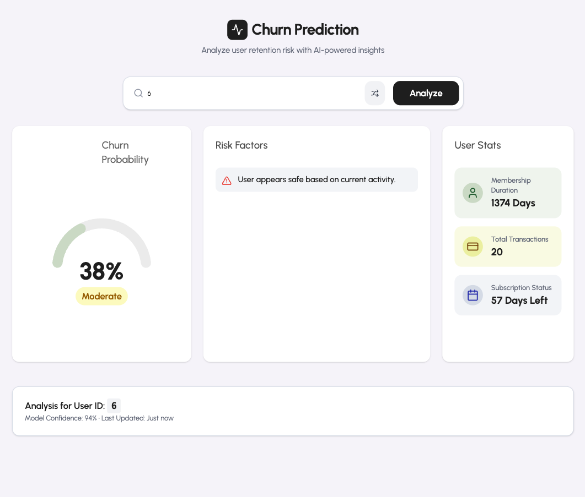

# Kullanıcı Ayrılma (Churn) Tahmini ve Önleme Sistemi

**Ders:** YZM 535 - Yapay Zeka Mühendisliği  
**Hazırlayan:** Hasan Burak Songur (Y250234086)  
**Ders Yürütücüsü:** Gözde Çay  
**Tarih:** 11.01.2026

---

## Proje Özeti
Bu proje, abonelik tabanlı dijital müzik servisleri (örneğin KKBox) için kullanıcıların aboneliklerini yenilememe (churn) riskini önceden tahmin eden yapay zeka tabanlı bir karar destek sistemidir. 

Proje kapsamında **XGBoost** algoritması kullanılarak geliştirilen model, kullanıcıların demografik bilgilerini, ödeme geçmişlerini ve dinleme alışkanlıklarını analiz eder. Sadece "Churn/Not Churn" tahmini yapmakla kalmaz, aynı zamanda yöneticiye **"Neden Riskli?"** sorusunun cevabını vererek aksiyon alınabilir içgörüler sunar.

Geliştirilen sistem, tahminleme API'si (Backend) ve modern bir Yönetici Paneli (Frontend) ile canlı bir uygulamaya dönüştürülmüştür.

---

## Özellikler
- **Yüksek Doğruluk:** %94 Precision ve 0.81 F1-Score ile optimize edilmiş XGBoost modeli.
- **Açıklanabilir Yapay Zeka (XAI):** Müşterinin neden riskli olduğunu açıklayan faktör analizi (Örn: "Otomatik ödeme kapalı", "Son 14 günde aktivite düşüşü").
- **Gelişmiş Özellik Mühendisliği:** RFM (Recency, Frequency, Monetary) ve Zaman Serisi Trend analizleri.
- **Canlı Dashboard:** Riskli kullanıcıları izlemek için React tabanlı interaktif arayüz.
- **Gerçek Zamanlı Simülasyon:** Eski tarihli verileri günümüze uyarlayan "Veri Zenginleştirme" modülü.

---

## Dashboard Ekran Görüntüleri

Aşağıda, geliştirilen sistemin kullanıcı arayüzüne ait örnek ekran görüntüleri yer almaktadır.

### 1. Risk Analiz Paneli
Kullanıcı risk skoru, churn olasılığı ve temel metriklerin görüntülendiği ana ekran.


### 2. Risk Analiz Paneli (Farklı Profil Örneği)
Aynı panelin farklı bir kullanıcı üzerindeki risk analizi görünümü. Kullanıcı ID'sine göre dinamik olarak değişen risk skoru ve veriler.



*(Not: Görseller temsilidir, projeyi çalıştırarak canlı arayüzü deneyimleyebilirsiniz.)*

---

## Teknik Mimari

Proje üç ana katmandan oluşmaktadır:

### 1. Yapay Zeka & Veri Bilimi (Python)
*   **Algoritma:** XGBoost (Final Model), Lojistik Regresyon, MLP, LSTM (Denenen Modeller).
*   **Veri Seti:** Kaggle KKBox Churn Prediction Challenge.
*   **Kütüphaneler:** Pandas, Scikit-learn, XGBoost, NumPy.

### 2. Backend (API)
*   **Framework:** FastAPI
*   **İşlev:** Eğitilmiş `.json` modelini yükler, gelen kullanıcı verisini işler ve churn olasılığını döndürür.

### 3. Frontend (Dashboard)
*   **Framework:** React (Vite) + TypeScript
*   **UI Kütüphanesi:** Tailwind CSS, Shadcn UI
*   **Görselleştirme:** Recharts (Risk göstergeleri ve grafikler için).

---

## Model Performansı

Proje sürecinde farklı algoritmalar denenmiş ve en iyi sonucu **XGBoost v4** modeli vermiştir.

| Model | Precision | Recall | F1-Score |
|-------|-----------|--------|----------|
| Lojistik Regresyon | 0.48 | 0.38 | 0.42 |
| MLP (Deep Learning) | 0.52 | 0.45 | 0.48 |
| Hibrit (Wide & Deep) | 0.40 | 0.30 | 0.34 |
| **XGBoost (Final v4)** | **0.94** | **0.71** | **0.81** |

### En Önemli Risk Faktörleri (Feature Importance)
Modelin karar verirken en çok dikkat ettiği özellikler:
1.  **is_cancel_sum:** Geçmiş iptal sayıları.
2.  **is_auto_renew_max:** Otomatik ödeme talimatı durumu.
3.  **days_to_expire:** Üyeliğin bitmesine kalan gün sayısı.
4.  **num_unq_trend:** Son 2 haftalık dinleme çeşitliliği değişimi.

---

## Proje Yapısı

```
yzm_535_project/
├── Kaynak_Kod/
│   ├── Backend/                # FastAPI Servisi ve Model Dosyaları
│   │   ├── main.py             # API Başlatıcı
│   │   ├── xgboost_final...    # Eğitilmiş Model Dosyası
│   │   └── ...
│   ├── Frontend/               # React Dashboard Uygulaması
│   │   ├── src/                # Arayüz Kodları
│   │   └── ...
│   └── Model_Egitim/           # Veri İşleme ve Eğitim Kodları (Jupyter/Python Scriptleri)
│       ├── 01_merge...py       # Veri Birleştirme Adımları
│       ├── ...
│       └── 24_v4_train...py    # Final Model Eğitimi
└── Raporlar/                   # Proje Raporları (PDF) ve Görseller
```

---

## Kurulum ve Çalıştırma

Projeyi yerel ortamınızda çalıştırmak için aşağıdaki adımları izleyin.

### Ön Koşullar
*   Python 3.9+
*   Node.js 18+

### 1. Backend'i (API) Başlatma
Terminalde şu komutları çalıştırın:

```bash
cd Kaynak_Kod/Backend
pip install -r requirements.txt
python main.py
```
*API `http://localhost:8000` adresinde çalışacaktır.*

### 2. Frontend'i (Dashboard) Başlatma
Yeni bir terminal penceresinde:

```bash
cd Kaynak_Kod/Frontend
npm install
npm run dev
```
*Uygulama `http://localhost:5173` adresinde açılacaktır.*

---

## Karşılaşılan Zorluklar ve Çözümler

1.  **Veri Dengesizliği (Imbalance):** Churn oranı veri setinde çok düşüktü.
    *   *Çözüm:* `scale_pos_weight` parametresi ile Churn sınıfına daha fazla ağırlık verildi.
2.  **Eski Tarihli Veri:** Veri seti 2017 yılına aitti, bu da dashboard'da güncel tarihli analiz yapmayı zorlaştırıyordu.
    *   *Çözüm:* Demo amaçlı **Veri Zenginleştirme (Data Augmentation)** yapılarak, verilerin tarihleri simülasyon için günümüze uyarlandı.

---

## Lisans
Bu proje YZM 535 dersi kapsamında eğitim amaçlı geliştirilmiştir. Veri seti hakları KKBox ve Kaggle'a aittir.